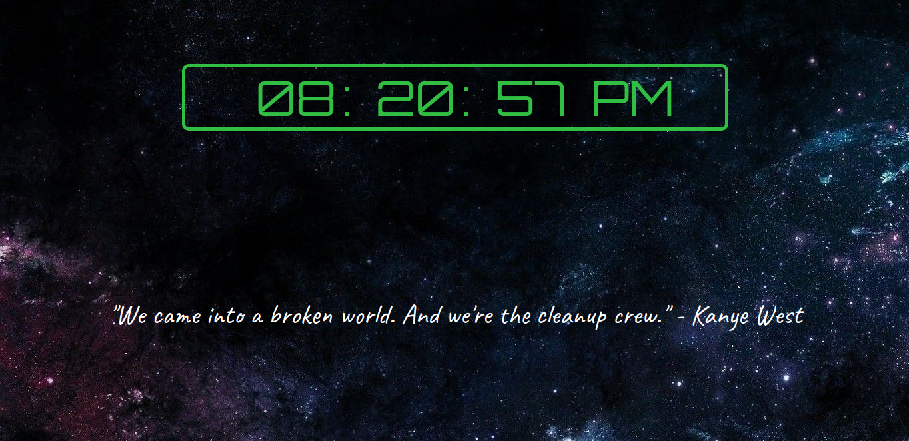

     
  <h2 align="center">
    Kanye West's Functional Clock
  </h2>

No livro "Learning React" (por Alex Banks e Eve Porcello, da Editora O'Reilly), Capítulo 3 - Programação Funcional com Javascript, o exemplo final do capítulo mostra como funciona o conceito de programação funcional de **composição** na prática.

O exemplo consiste de um simples relógio feito com conceitos de programação funcional e que mostra as horas no console.

Escrevi o exemplo para praticar os conceitos ensinados, mas aproveitei para praticar, também, um pouco de HTML/CSS/JS e dei uma "enfeitada" no execício: Um fundo legalzudo de universo, renderizar o relógio no lugar de mostrar no console e citações aleatórias do Kanye West a cada reload. 😎

> Se quiser usar esse app de homepage pro seu navegador, ele está online em https://functional-clock.netlify.com/
